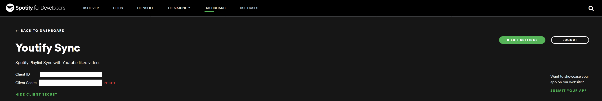

# SpotifyGeneratePlaylist
A simple script that takes your liked videos on Youtube, and generates a Spotify playlist based on the song in your liked videos.

## Table of Contents
* [Technologies](#Technologies)
* [Setup](#LocalSetup)
* [ToDo](#ToDo)

## Technologies
* [Youtube Data API v3]
* [Spotify Web API]
* [Requests Library]
* [Youtube_dl]
* [Spotipy]

## LocalSetup
1) Install All Dependencies   
`pip3 install -r requirements.txt`

2) Collect You Spotify User ID, Spotify Client ID and Spotify Client Secret and add it to secrets.py file
    * To Collect your User ID, Log into Spotify then go here: [Account Overview] and its your **Username**
    
    * To Collect your Spotify Client ID and Spotify Client Secret, you need to create an Spotify app in the developers webpage. Once it's done, you will obtain both values
    

3) Enable Oauth For Youtube and download the client_secrets.json   
    * Ok this part is tricky but its worth it! Just follow the guide here [Set Up Youtube Oauth] ! 
    If you are having issues check this out [Oauth Setup 2] and this one too [Oauth Setup 3] 

4) Run the File  
`python3 create_playlist.py`   
    * you'll immediately see `Please visit this URL to authorize this application: <some long url>`
    * click on it and log into your Google Account to collect the `authorization code`
    * You will need to repeat a similar process with Spotify

## ToDo
* Tests
* Add Error Handling

   [Youtube Data API v3]: <https://developers.google.com/youtube/v3>
   [Spotify Web API]: <https://developer.spotify.com/documentation/web-api/>
   [Requests Library]: <https://requests.readthedocs.io/en/master/>
   [Account Overview]: <https://www.spotify.com/us/account/overview/>
   [Get Oauth]: <https://developer.spotify.com/console/post-playlists/>
   [Set Up Youtube Oauth]: <https://developers.google.com/youtube/v3/getting-started/>
   [Oauth Setup 2]:<https://stackoverflow.com/questions/11485271/google-oauth-2-authorization-error-redirect-uri-mismatch/>
   [Youtube_dl]:<https://github.com/ytdl-org/youtube-dl/>
   [Spotipy]:<https://github.com/plamere/spotipy/>
   [Oauth Setup 3]:<https://github.com/googleapis/google-api-python-client/blob/master/docs/client-secrets.md/>